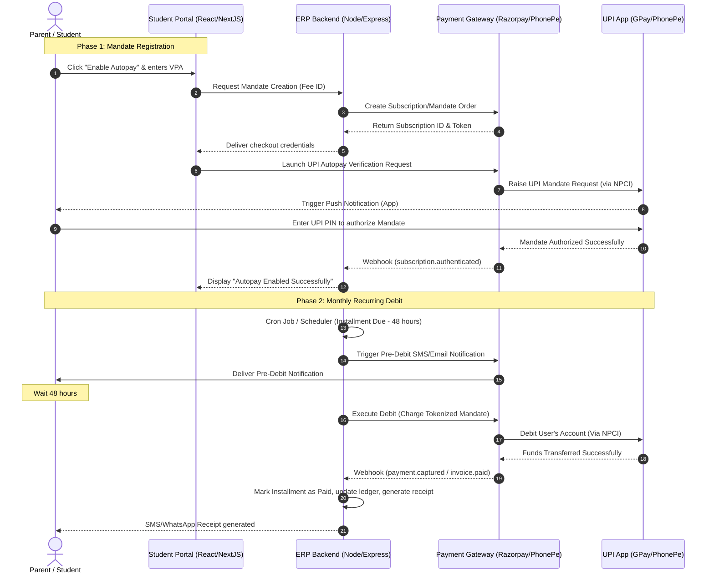

# UPI Autopay & Auto-Debit Architecture Blueprint
## Student Fee Subscription Engine for IMS-V2 ERP

This document outlines the technical design, product workflow, API design, and database schema extensions required to implement a production-grade **UPI Auto-Debit (Autopay) / e-Mandate** system for student fees using leading Payment Gateways in India (Razorpay, Cashfree, or PhonePe PG).

---

## 1. Product Experience Flow (UX)

For popular consumer apps like **Google Pay** and **PhonePe**, direct mandate setup is executed using the **NPCI UPI Autopay** standard. Since direct merchant API access is restricted by NPCI, the integration is routed via an authorized Payment Gateway (PG).

### Phase 1: Registration & Mandate Consent
```
[Student Fees Portal] ──> [Enable Autopay Option] ──> [Select UPI App / Enter UPI ID]
                                                                  │
[Mandate Active] <── [Verify UPI App & Enter PIN] <── [UPI App Push Notification]
```
1. **Discovery**: The student (or parent) logs into the Student Portal and navigates to the **Financial Overview / Fees** section.
2. **Opt-in**: Next to the pending installment plan, a premium banner displays: *"Tired of manual reminders? Enable UPI Autopay (Google Pay, PhonePe, Paytm) to automatically clear your installments."*
3. **Gateway Checkout**: When clicked, the page loads a secure PG checkout frame:
   - User inputs their **UPI VPA / ID** (e.g., `username@okhdfcbank` or `mobile@ybl`) or selects the App directly (if on mobile).
   - The Gateway executes a **₹1 or ₹2 verification mandate setup transaction** (refundable).
4. **App Authorization**: A push notification is triggered on the user's smartphone via GPay or PhonePe. 
5. **PIN Approval**: The user opens their UPI app, reviews the mandate terms (Maximum Amount, Frequency: *Monthly/As Invoiced*, Start/End Date), and enters their **UPI PIN** to authenticate.
6. **Confirmation**: The mandate is active! The Student Portal is instantly updated using webhooks.

### Phase 2: Recurring Execution (Auto-Debit Cycle)
```
[Installment Due - 48h] ──> [Send Pre-Debit Notification] (Required by RBI/NPCI)
                                      │
[Installment Marked Paid] <── [PG Webhook Received] <── [Auto-Debit Executed at 8 AM]
```
1. **Pre-Debit Notification (Mandatory by RBI & NPCI)**: 
   - A SMS/Email/WhatsApp notification is triggered to the parent/student **24 to 48 hours prior** to the actual debit.
   - Example: *"Dear Parent, ₹15,000 will be auto-debited for your monthly tuition fee on May 10, 2026. Please ensure sufficient balance."*
2. **Mandate Execution**: On the morning of the installment due date (typically 8:00 AM IST), the PG backend executes the recurring charge.
3. **Transaction Processing**:
   - **Under ₹15,000**: Debited seamlessly **without requiring any UPI PIN/OTP** (per RBI limits).
   - **Over ₹15,000**: Debited automatically if the mandate allows, or triggers a one-click authentication request depending on the bank.
4. **Reconciliation**: If successful, the gateway triggers a webhook to `POST /api/v1/webhooks/payments` in our ERP. The local system instantly generates the receipt and updates the student ledger.

---

## 2. Technical Architecture & Data Flow

Below is the end-to-end integration diagram mapping the Student Portal, the ERP Backend, and the Payment Gateway.



---

## 3. Database Schema Design (Mongoose Extensions)

To capture autopay status and payment gateway subscription tokens, the existing `Fee` (or new `UPIAutopay`) models need database fields.

### `Fee` Schema Extensions (`models/Fee.js`)
```javascript
const FeeSchema = new mongoose.Schema({
    // Existing fields...
    student: { type: mongoose.Schema.Types.ObjectId, ref: 'Student', required: true },
    batch: { type: mongoose.Schema.Types.ObjectId, ref: 'Batch' },
    totalAmount: { type: Number, required: true },
    paidAmount: { type: Number, default: 0 },
    balanceAmount: { type: Number, required: true },
    status: { type: String, enum: ['not_started', 'partial', 'paid', 'overdue'], default: 'not_started' },
    
    // Autopay Configuration
    autopay: {
        enabled: { type: Boolean, default: false },
        gateway: { type: String, enum: ['razorpay', 'cashfree', 'phonepe'], default: 'razorpay' },
        subscriptionId: { type: String }, // Token from PG referencing the recurring plan
        mandateToken: { type: String }, // Auth token for recurring debits
        vpa: { type: String }, // Masked VPA (e.g., parent***@okaxis)
        status: { type: String, enum: ['pending_auth', 'active', 'suspended', 'cancelled'], default: 'pending_auth' },
        createdAt: { type: Date },
        updatedAt: { type: Date }
    },
    
    installments: [{
        amount: { type: Number, required: true },
        dueDate: { type: Date, required: true },
        status: { type: String, enum: ['pending', 'paid', 'overdue'], default: 'pending' },
        paidDate: { type: Date },
        paymentMethod: { type: String }, // "UPI_AUTOPAY"
        transactionId: { type: String },
        autopayExecutionLog: {
            attempts: { type: Number, default: 0 },
            lastAttemptDate: { type: Date },
            failureReason: { type: String }
        }
    }]
});
```

---

## 4. API Endpoints

### 1. Register Mandate Request
* **Endpoint**: `POST /api/v1/student/autopay/register`
* **Access**: Student Session
* **Request Body**:
  ```json
  {
    "feeId": "65b821a8cd2b11234b67890f",
    "vpa": "parent@okhdfcbank",
    "gateway": "razorpay"
  }
  ```
* **Response**:
  ```json
  {
    "success": true,
    "subscriptionId": "sub_NfG78shfHkd8",
    "paymentDetails": {
      "amount": 100, // ₹1 or ₹2 setup fee
      "currency": "INR",
      "method": "upi",
      "upi": {
        "flow": "intent"
      }
    }
  }
  ```

### 2. Cancel Autopay Mandate
* **Endpoint**: `POST /api/v1/student/autopay/cancel`
* **Access**: Student / Registrar / Admin Session
* **Request Body**:
  ```json
  {
    "feeId": "65b821a8cd2b11234b67890f"
  }
  ```
* **Response**:
  ```json
  {
    "success": true,
    "message": "Autopay mandate cancelled successfully. Subsequent installments will require manual payments."
  }
  ```

### 3. Payment Gateway Webhook Receiver
* **Endpoint**: `POST /api/v1/webhooks/payments`
* **Access**: Public (PG Signature verified using secret)
* **Request Headers**:
  - `x-razorpay-signature`: HMAC-SHA256 signature verification.
* **Controller Flow**:
  ```javascript
  const handlePaymentWebhook = async (req, res) => {
      const secret = process.env.PAYMENT_WEBHOOK_SECRET;
      // 1. Verify PG cryptographic signature...
      if (!verifySignature(req.body, req.headers['x-razorpay-signature'], secret)) {
          return res.status(400).json({ error: "Invalid signature" });
      }

      const event = req.body.event;
      const payload = req.body.payload;

      switch(event) {
          case 'subscription.authenticated':
              // User successfully set up the UPI Mandate in GPay/PhonePe
              await enableAutopayStatus(payload.subscription.entity);
              break;
              
          case 'invoice.payment_succeeded':
              // Recurring installment auto-debit succeeded
              await recordAutopayReceipt(payload.invoice.entity);
              break;
              
          case 'subscription.charged_failed':
              // Recurring debit failed (e.g. insufficient funds)
              await handleAutopayFailure(payload.subscription.entity);
              break;
      }
      
      res.status(200).json({ received: true });
  };
  ```

---

## 5. Scheduler & RBI Compliance Controls (Cron Logic)

The RBI mandates that **all automatic debits must be pre-announced to the user 24-48 hours in advance**. The ERP must run a daily scheduler (e.g., at 6:00 AM IST) to evaluate upcoming installments.

```javascript
// Run daily at 6:00 AM via cron / Agenda / BullMQ
const executePreDebitCheck = async () => {
    const targetDate = new Date();
    targetDate.setDate(targetDate.getDate() + 2); // 48 hours later

    // Find all outstanding installments due in exactly 48 hours with Autopay enabled
    const feesWithPendingAutopay = await Fee.find({
        "autopay.enabled": true,
        "autopay.status": "active",
        "installments": {
            $elemMatch: {
                status: "pending",
                dueDate: {
                    $gte: startOfDay(targetDate),
                    $lte: endOfDay(targetDate)
                }
            }
        }
    }).populate('student');

    for (let fee of feesWithPendingAutopay) {
        const upcomingInstallment = fee.installments.find(
            inst => inst.status === "pending" && 
            inst.dueDate >= startOfDay(targetDate) && 
            inst.dueDate <= endOfDay(targetDate)
        );

        // Trigger Pre-Debit Notification API (via SMS, WhatsApp, & Push Notification)
        await notificationService.sendPreDebitAlert({
            phone: fee.student.profile.phone || fee.student.parentPhone,
            studentName: fee.student.name,
            amount: upcomingInstallment.amount,
            dueDate: upcomingInstallment.dueDate,
            vpa: fee.autopay.vpa
        });
        
        // Log notification timestamp in DB to maintain audit trail
        upcomingInstallment.autopayExecutionLog.preDebitNotifiedAt = new Date();
        await fee.save();
    }
};
```

---

## 6. Implementation Checklist & Timeline

| Step | Action Item | Target Stakeholder | Complexity |
| :--- | :--- | :--- | :--- |
| **1** | Register Merchant Account with **Razorpay Subscriptions** or **Cashfree** and complete e-Mandate / UPI Autopay onboarding. | Finance / Admin | Medium |
| **2** | Deploy Mongoose Schema Extensions to support `autopay` configurations. | Backend Dev | Low |
| **3** | Build Backend Integration Services (`services/paymentGatewayService.js`) to handle mandate creation and cancellations. | Backend Dev | High |
| **4** | Securely wire webhook handler `/api/v1/webhooks/payments` to dynamically reconcile student invoices. | Backend Dev | Medium |
| **5** | Implement Cron task for pre-debit notifications (SMS/WhatsApp) to satisfy RBI compliance. | Backend Dev / Ops | Medium |
| **6** | Build the **UPI Autopay setup UI** inside the Student Fees Page (`app/student/fees/page.jsx`) using Razorpay Checkout SDK. | Frontend Dev | Medium |
| **7** | End-to-end sandbox testing using Mock UPI VPAs to simulate success, mandate expiration, and account balance failures. | QA / Dev | Medium |

---
*Created for Quantech International School & IMS-V2 Platform. All system specifications adhere strictly to NPCI Autopay Standards and RBI Directives.*
